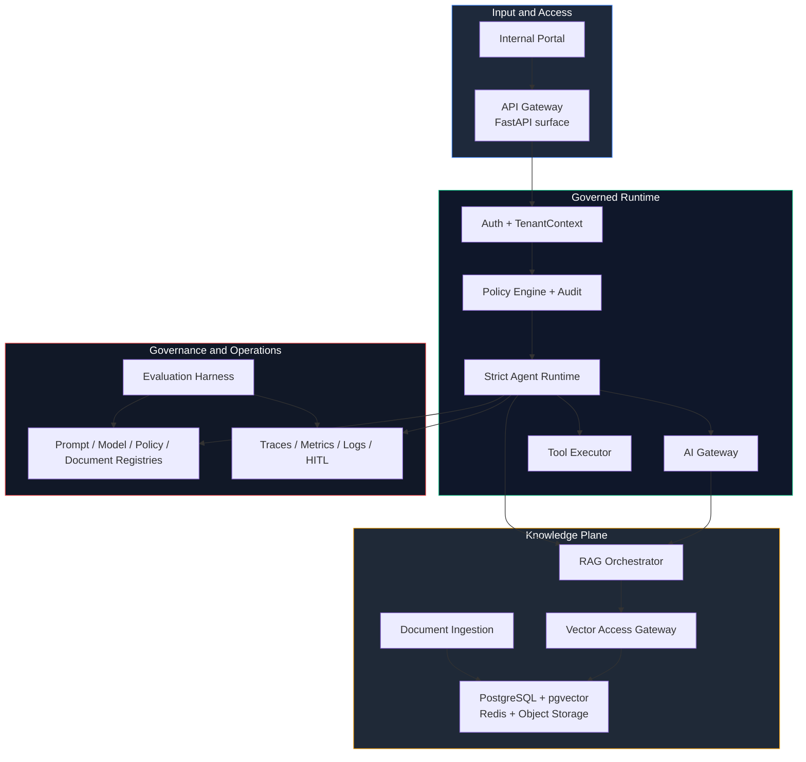

<div align="center">

# SentinelGraph

### Build a governed multi-tenant agentic RAG platform for internal financial AI use cases

[](docs/INDEX.md)
[](docs/INDEX.md)
[](docs/SPEC.md)
[](docs/ARCHITECTURE.md)
[](pyproject.toml)

*Open-code edition of a client delivery, adapted for public architecture review and reproducible implementation without client-private data, integrations, or operational secrets.*

</div>

---

## Value Proposition

Most internal AI projects fail at the control plane, not the prompt layer. Tenant isolation, retrieval policy, tool governance, auditability, and safe failure arrive too late, after the first demo already shaped the wrong architecture.

**SentinelGraph** publishes that control plane up front.

| Without This Platform | With This Platform |
|---|---|
| AI features are added app by app | A single governed runtime defines the execution path |
| Tenant checks live in scattered service code | Tenant enforcement is designed across **API, policy, DB, vector, cache, tool, and audit layers** |
| Retrieval behaves like plain semantic search | Retrieval is forced through a **Vector Access Gateway** with server-side filters |
| Agent loops are hard to bound | The runtime is a **strict graph** with budget, policy, and HITL gates |
| Answers are hard to explain later | Responses are designed for **citations, traces, audit records, and artifact versioning** |

**Bottom line:** this repository is the public open-code version of a real client project, shaped so the implementation path leads to production-grade code instead of a throwaway prototype.

---

## Architecture



---

## Tech Stack & Why

| Technology | Version | Why This Choice |
|---|---|---|
| **Python** | 3.12+ | Single language across API, runtime, ingestion, evaluation, and governance paths |
| **FastAPI + Pydantic v2** | current target | Typed contracts for request validation, tool schemas, Agent State, and policy IO |
| **PostgreSQL** | 16+ | Strong relational integrity, JSONB metadata, audit storage, and Row-Level Security path |
| **pgvector** | current target | MVP-friendly vector search with tight metadata alignment to document registries |
| **Redis** | 7+ | Token buckets, cache coordination, short-lived state, and background job support |
| **OpenTelemetry** | current target | Unified tracing model for API, model calls, retrieval, tools, and runtime nodes |
| **Celery -> Temporal path** | staged | Fast MVP workflow engine now, durable workflow option later for long-running HITL and ingestion flows |
| **Custom GraphRunner + CrewAI adapter** | internal runtime | Keeps framework convenience without making an external agent framework the security boundary |

---

## Quick Start

### Prerequisites
- `git`
- `python 3.12+`
- `uv`
- Docker is optional at the current stage and becomes relevant when local infra services are needed

### 1. Clone & Configure
```bash
git clone <your-fork-or-repo-url>
cd sentinel-graph
uv python list
uv sync
```

### 2. Inspect the Architecture Blueprint
```bash
python -c "from pathlib import Path; [print(p) for p in sorted(Path('docs').glob('*.md'))]"
```

This repository currently exposes:

| Area | Status | Purpose |
|---|---|---|
| `docs/` | published | canonical product, security, stack, and implementation documents |
| `apps/` | active baseline | API routes and composition for health, policy, AI gateway, documents, RAG, and AI requests |
| `packages/` | active baseline | implemented modules for common DB, security, governance, AI gateway, ingestion, and RAG |
| `infra/` | partial baseline | Alembic and infra scaffolding for the implementation track |
| `tests/` | active baseline | unit and integration suites covering the implemented modules |

### 3. Start with the Canonical Reading Order
```bash
python -c "print('1. docs/INDEX.md\\n2. docs/SPEC.md\\n3. docs/ARCHITECTURE.md\\n4. docs/TENANT_MODEL.md\\n5. docs/IMPLEMENTATION_PLAN.md')"
```

### 4. Verify the Current Baseline
```bash
uv run pytest tests/unit/rag tests/integration/test_rag_route.py tests/integration/test_ai_requests_route.py -q
```

---

## Project Structure

```txt
sentinel-graph/
|-- apps/                          # API, worker, and admin entrypoints
|   |-- api/                       # Internal HTTP surface and route composition
|   |-- worker/                    # Async jobs for ingestion, evals, and governance
|   `-- admin/                     # Reviewer and operational surfaces
|
|-- packages/                      # Core platform modules
|   |-- common/                    # Shared contracts, IDs, and DB base utilities
|   |-- security/                  # Auth, TenantContext, PII, prompt firewall, secrets
|   |-- observability/             # Traces, metrics, logs, correlation
|   |-- governance/                # Audit, HITL, artifact registries, policy
|   |-- ai_gateway/                # Provider routing, token budget, fallback, cache
|   |-- rag/                       # Retrieval, grounding, citations, vector access
|   |-- tools/                     # Tool registry, schema validation, executor
|   |-- agent_runtime/             # Strict graph, state, nodes, policy hooks
|   |-- ingestion/                 # Parse -> chunk -> embed -> activate flow
|   `-- evaluation/                # Golden datasets, safety suites, regression harness
|
|-- infra/                         # Docker, Kubernetes, Terraform, Helm
|-- tests/                         # Unit, integration, security, eval, and load suites
|-- docs/                          # Canonical architecture and implementation docs
|-- .gitignore                     # Local-only exclusions, including .local/
|-- pyproject.toml                 # Python package metadata and runtime floor
`-- README.md                      # Public repository overview
```

---

## Security

- **TenantContext-first** - every sensitive operation is designed to require trusted tenant context before model, retrieval, cache, tool, audit, or HITL access.
- **Gateway-only AI** - all model and embedding calls must go through the `AI Gateway`; direct provider SDK usage in business logic is an architectural violation.
- **Vector isolation** - retrieval must pass through the `Vector Access Gateway` with server-side tenant, ACL, status, and classification filters.
- **Secrets discipline** - `.env` stays local, `.local/` is gitignored, and production secret handling is designed behind a `SecretProvider` abstraction.
- **Narrow browser/API boundary** - CORS should remain environment-scoped and restrictive when the FastAPI surface is published.
- **Fail-closed execution** - when tenant, policy, grounding, output, or approval checks fail, the platform denies, refuses, or escalates instead of continuing unsafely.

---

## Testing

```bash
uv run pytest tests/ -v
```

Current public snapshot: the docs remain the canonical blueprint, but the repository is already in baseline implementation across the platform core.

---

<div align="center">

**A public, production-oriented blueprint for governed financial AI, released as open-code from a real client delivery.**

[Spec](docs/SPEC.md) | [Architecture](docs/ARCHITECTURE.md) | [Threat Model](docs/THREAT_MODEL.md) | [Implementation Plan](docs/IMPLEMENTATION_PLAN.md) | [Roadmap](docs/ROADMAP.md)

</div>
